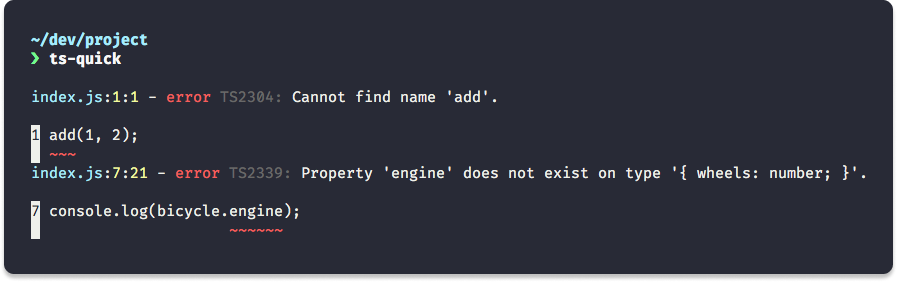

<p align="center">
  
  <h3 align="center">ts-quick️</h3>
  <p align="center">Zero-configuration JavaScript static analysis tool</p>
  <p align="center">
    <a href="https://travis-ci.org/matchai/ts-quick"></a>
    <a href="https://codecov.io/gh/matchai/ts-quick"></a>
    <a href="https://www.npmjs.com/package/ts-quick"></a>
    <a href="https://www.npmjs.com/package/ts-quick"></a>
  </p>
</p>

---

Easily catch bugs and enforce JSDoc types throughout your JavaScript project using the proven power of TypeScript.
Either use it as a standalone CLI, or add it to your test script to ensure that your JS the best it can be.



## Install

```
$ npm install --global ts-quick
```

## Usage

```
$ ts-quick --help

  Usage
    $ ts-quick [<file|glob> ...]

  Options
    --init         Add ts-quick to your project
    --implicitAny  Allow variables to implicitly have the "any" type
    --ignore       Additional paths to ignore  [Can be set multiple times]
    --cwd=<dir>    Working directory for files

  Examples
    $ ts-quick
    $ ts-quick index.js
    $ ts-quick *.js !foo.js
    $ ts-quick --init
    $ ts-quick --implicitAny
```

## Workflow

The recommended workflow is to add ts-quick locally to your project to have it run with tests.

Simply run `$ ts-quick --init` to add ts-quick to your package.json.

### Before

```json
{
  "name": "example-package",
  "scripts": {
    "test": "jest"
  },
  "devDependencies": {
    "jest": "^23.0.0"
  }
}
```

### After

```json
{
  "name": "example-package",
  "scripts": {
    "test": "ts-quick && jest"
  },
  "devDependencies": {
    "jest": "^23.0.0",
    "ts-quick": "^1.1.0"
  }
}
```

Then just run `$ npm test` and ts-quick will be run before your tests.

## Config

You can configure options in ts-quick by putting them in package.json:

```json
{
  "name": "example-package",
  "ts-quick": {
    "implicitAny": true,
    "ignores": ["./test", "foo.js"]
  }
}
```

### implicitAny

Type: `boolean`<br>
Default: `false` _(types are required)_

If enabled, ts-quick allows expressions and declarations to have an implied `any` type.

### ignores

Type: `Array`

Some [paths](lib/options-manager.js) are ignored by default, including paths in `.gitignore`. Additional ignores can be added here.

## License

ISC © [Matan Kushner](https://matchai.me/)

### Attribution

The ts-quick logo is a derivative of the "flash-outline" icon in [Typicons](https://github.com/stephenhutchings/typicons.font) by [stephenhutchings](https://github.com/stephenhutchings), used under [CC BY-SA](https://creativecommons.org/licenses/by-sa/3.0/).<br>The ts-quick logo is licensed under [CC BY-SA](https://creativecommons.org/licenses/by-sa/3.0/) by [Matan Kushner](https://matchai.me/).
